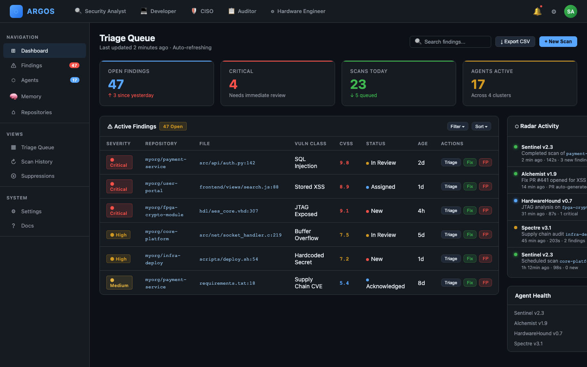
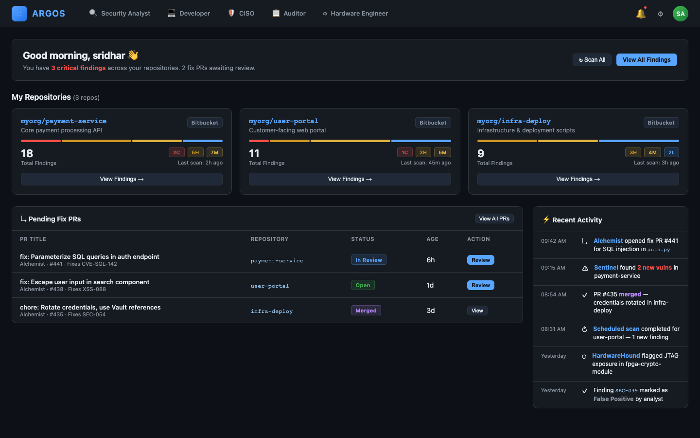
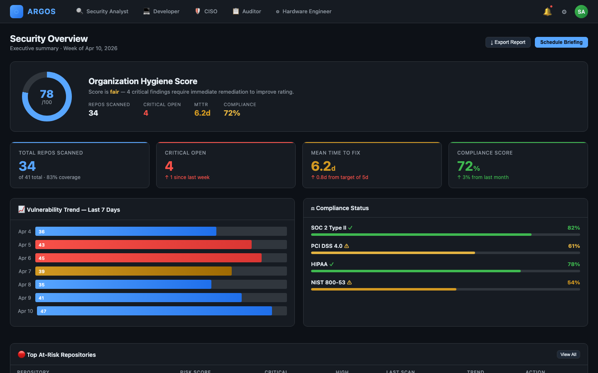
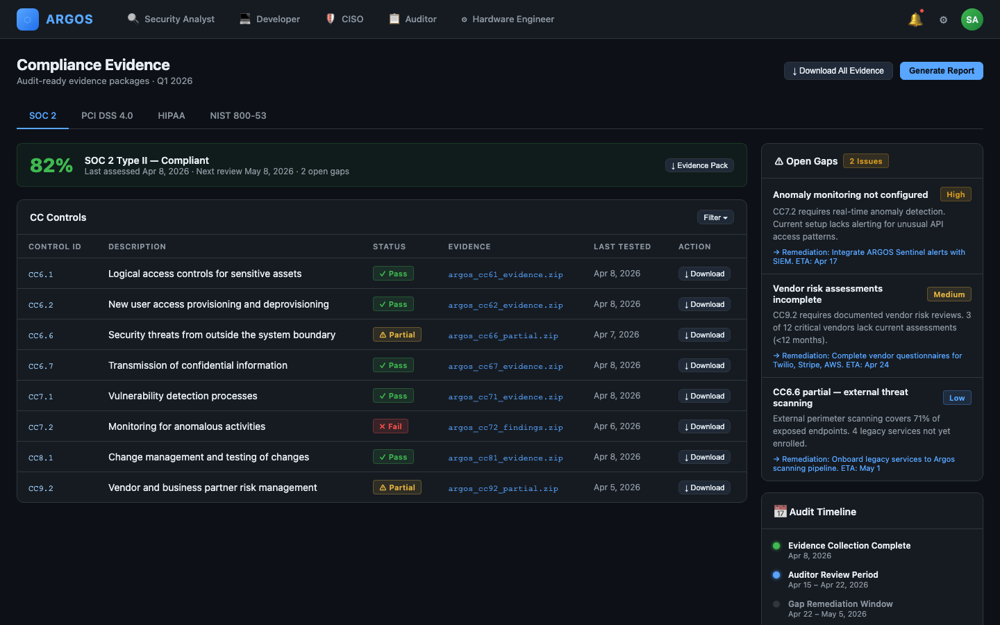
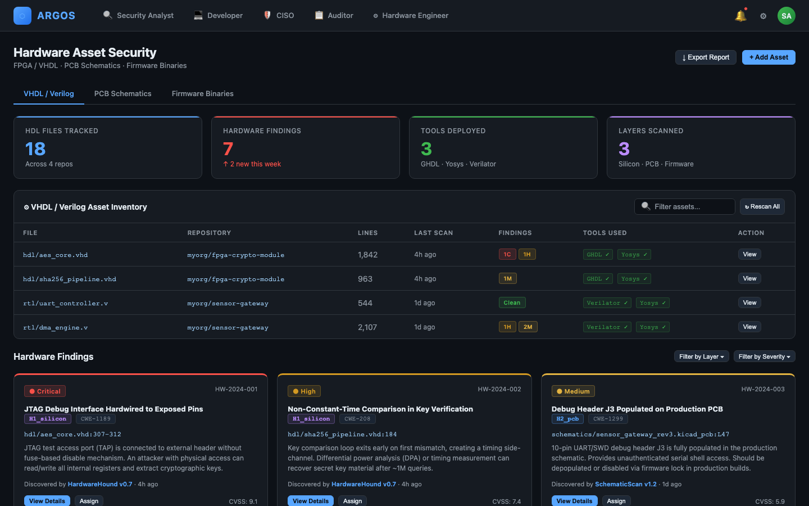

# ARGOS — UI Mockups

> Adaptive Radar & Guard for Organizational Security · User Persona Screens

---

## 1. Security Analyst

Triage queue with live finding table, severity badges, CVSS scores, and Radar agent activity panel.

---

## 2. Developer

Personal repo overview with severity bars, Alchemist fix PR status, and activity feed.

---

## 3. CISO

Executive dashboard with hygiene score ring, 7-day vulnerability trend, and compliance status across SOC2 / PCI-DSS / HIPAA / NIST.

---

## 4. Auditor

Compliance evidence panel with SOC2 control table, Pass/Fail/Partial badges, evidence downloads, and open gap tracker.

---

## 5. Hardware Engineer

Hardware asset inventory with VHDL/Verilog file table, GHDL/Yosys tool badges, and hardware finding cards (JTAG, timing side-channel, PCB debug header).

---

> Interactive version: [mockups.html](mockups.html)
> Platform: [github.com/stacksry/argos-security-platform](https://github.com/stacksry/argos-security-platform)
